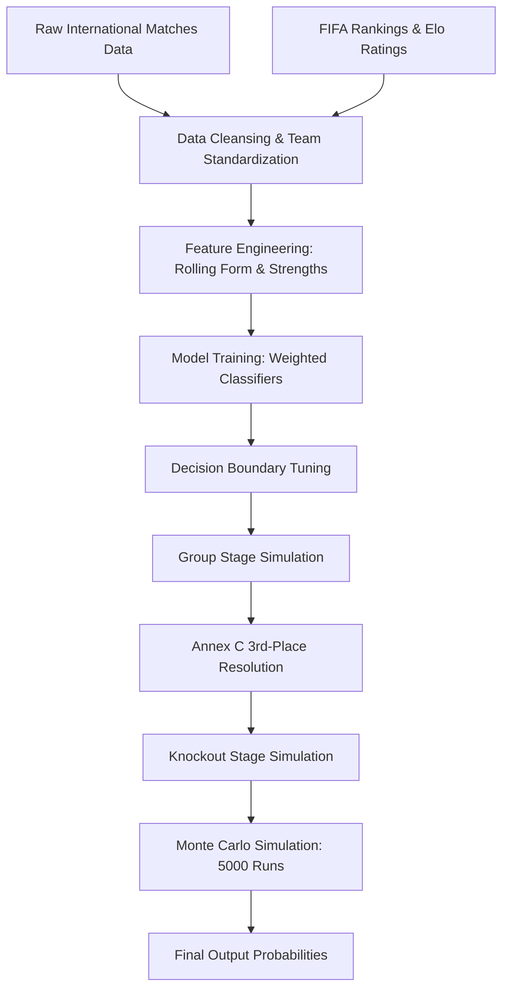

# FIFA World Cup 2026 Simulation Methodology

This document outlines the machine learning pipeline, feature engineering, modeling strategy, and tournament simulation logic used to forecast the 2026 FIFA World Cup.

## 1. Pipeline Architecture

---

## 2. Preprocessing & Team Name Standardization
Historical international datasets use various naming schemes for countries (e.g., "USA" vs "United States", "Korea Republic" vs "South Korea"). 
- **Standardization:** We resolve these using a comprehensive dictionary mapping of `TEAM_ALIASES` combined with unicode normalization.
- **Date Safeties:** Matches are sorted chronologically and dates parsed under multiple fallback ISO formats to ensure a clean match timeline.

---

## 3. Feature Engineering
Predictive features are constructed from historical matchups using a backward-looking rolling window:
- **Rolling Matches History:** Calculates win rate, draw rate, average goals for, average goals against, and goal differences over a moving 12-match queue window starting from 2018.
- **Temporal Merges (`merge_asof`):** Historical FIFA rankings and Elo ratings are merged dynamically back to the exact date of each match, preventing data leakage.
- **Calibrated Power Score:** Combines historical rankings, Elo scores, and recent form metrics into a single calibrated country index.
- **Sigmoid Recent Form:** Form ratings are derived using a sigmoid function applied to goal differences over recent games.

---

## 4. Modeling Strategy
We frame match prediction as a multi-class classification problem with three outcomes: Home Win (2), Draw (1), and Away Win (0).

### Weighted Training Loop
To account for changes in team chemistry and tactics, matches are weighted by:
- **Recency:** Matches played $\geq$ 2023 get a `+1.25` weight; 2021–2022 matches get a `+0.50` weight.
- **Tournament Importance:** World Cups and major continental tournaments (Euros, Copa America) get a `+0.75` weight; Nations League and qualifiers get `+0.35`.

### Models Evaluated
- **Random Forest Classifier (Tuned):** 700 estimators, max depth 14, class weight balanced.
- **Extra Trees Classifier:** 800 estimators, max depth 16.
- **HistGradientBoosting Classifier:** 320 max iterations, learning rate 0.04.

### Boundary Multiplier Grid Search
Because soccer matches are frequently draws, class probabilities are tuned using class multipliers (Home, Draw, Away weights) via grid search to align prediction thresholds with empirical outcomes, boosting test set accuracy to **58.04%** (compared to a **47.32%** majority baseline).

---

## 5. Tournament & Bracket Simulation
The 2026 World Cup uses a new 48-team layout with 12 groups of 4 teams.

### Group Stage
Each group's round-robin matchups are simulated. Tiebreakers are resolved in accordance with FIFA regulations:
1. Points
2. Head-to-Head points
3. Head-to-Head goal difference
4. Head-to-Head goals scored
5. Overall Goal Difference
6. Overall Goals Scored
7. Historical FIFA Rank (fallback)

### Annex C Third-Place Resolution
The 8 best third-place teams advance to the Round of 32. The tournament layout maps which group winners play which third-place qualifiers based on the specific combination of qualifying groups. We programmatically parse the official FIFA Annex C lookup table to resolve these matchups dynamically.

### Knockout Stage
Knockout games are resolved using cached model probabilities. If a match is drawn, the simulator resolves progression based on the relative calibrated Power Scores of the teams.

### Monte Carlo Engine
The entire simulation is run 5,000 times to compute:
- Champion probability distributions.
- Stage-by-stage progression likelihoods (R32, R16, QF, SF, Final).
